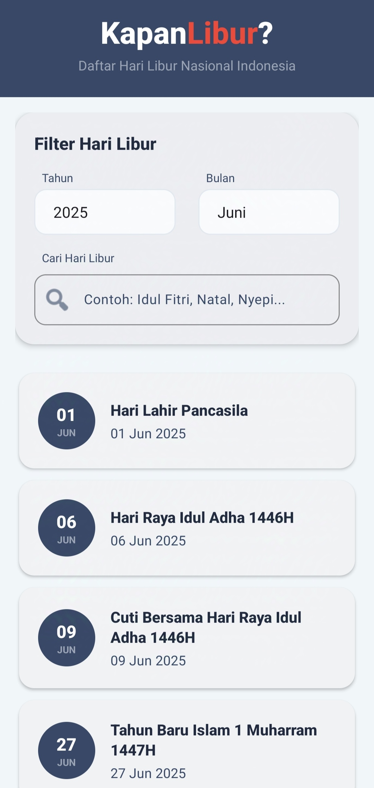
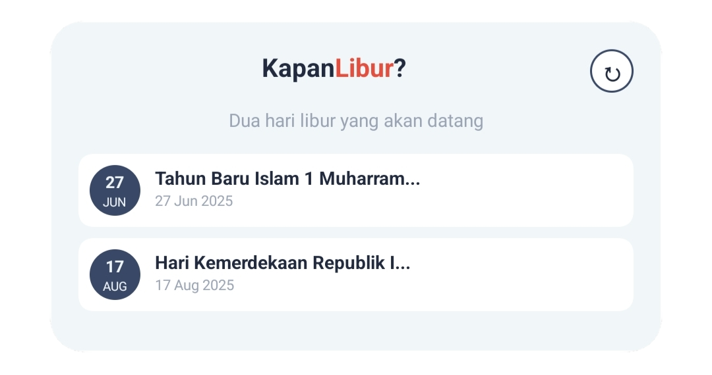

# <b>Kapan<span style="color:red;">Libur</span>?</b> - Aplikasi dan Widget Daftar Libur Nasional Indonesia

Aplikasi Android modern yang di buat dengan Kotlin untuk menampilkan hari libur nasional Indonesia menggunakan API [https://libur.deno.dev/](https://libur.deno.dev/).

## Fitur

### 🏠 Aplikasi Utama
- **Daftar Hari Libur**: Lihat semua hari libur nasional Indonesia.
- **Filter Tahun dan bulan**: Pilih tahun berbeda untuk melihat hari libur.
- **Pencarian**: Cari hari libur berdasarkan nama perayaan.



### 📅 Widget
- **Hari Libur Mendatang**: Menampilkan dua hari libur mendatang.
- **Tombol Refresh**: Refresh data hari libur jika gagal memuat data.



## Penggunaan

1. Unduh aplikasi dari [Halaman Rilis](https://placeholder-link-to-release-page.com).
2. Instal APK di perangkat Android Anda.
3. Buka aplikasi dan jelajahi hari libur nasional Indonesia.
4. Tambahkan widget ke layar utama untuk untuk melihat hari libur mendatang langsung tanpa membuka aplikasi.

## Bahasa Pemrograman

- Kotlin

## Atribusi API

Aplikasi ini menggunakan API [https://libur.deno.dev/](https://libur.deno.dev/) yang dibuat oleh [radyakaze](https://github.com/radyakaze/api-hari-libur). Data bersumber dari situs web [tanggalan.com](https://tanggalan.com).


## Dependensi
- **Retrofit**: HTTP client untuk komunikasi API
- **Kotlinx Serialization**: Parsing JSON
- **Material Design**: Komponen UI modern

## Integrasi API
- **Base URL**: `https://libur.deno.dev/`
- **Endpoints**:
  - `/api` - Semua hari libur untuk tahun berjalan
  - `/api?year=YYYY` - Hari libur untuk tahun tertentu
  - `/api?month=MM` - Hari libur untuk bulan tertentu
  - `/api?year=YYYY&month=MM` - Hari libur untuk tahun dan bulan tertentu


## Struktur Proyek

```
app/src/main/java/com/example/kapanlibur/
├── MainActivity.kt                 # Main Activity
├── KapanLiburApplication.kt       # Class aplikasi
├── data/
│   ├── api/
│   │   └── HolidayApiService.kt   # Interface API Retrofit
│   ├── model/
│   │   ├── Holiday.kt             # Model data hari libur
│   │   └── Result.kt              # Wrapper hasil
│   └── repository/
│       └── HolidayRepository.kt   # Repository data
├── di/
│   └── NetworkModule.kt           # Dependency injection
├── ui/main/
│   ├── HolidayAdapter.kt          # Adapter RecyclerView
│   └── MainViewModel.kt           # ViewModel layar utama
└── widget/
    └── HolidayWidget.kt           # Widget layar utama
```

## File Utama

### Model Data
- `Holiday.kt`: Merepresentasikan hari libur dengan tanggal dan nama
- `Result.kt`: Kelas sealed untuk menangani status loading/sukses/error

### Layanan API
- `HolidayApiService.kt`: Interface Retrofit yang mendefinisikan endpoint API

### Komponen UI
- `MainActivity.kt`: Layar utama dengan daftar hari libur dan filter
- `HolidayAdapter.kt`: Adapter RecyclerView untuk daftar hari libur
- `MainViewModel.kt`: ViewModel yang mengelola status UI

### Widget
- `HolidayWidget.kt`: AppWidgetProvider untuk widget layar utama
- `widget_holiday.xml`: Tata letak widget
- `holiday_widget_info.xml`: Konfigurasi widget


## Lisensi

Proyek ini untuk tujuan edukasi dan demonstrasi praktik pengembangan Aplikasi Android.
